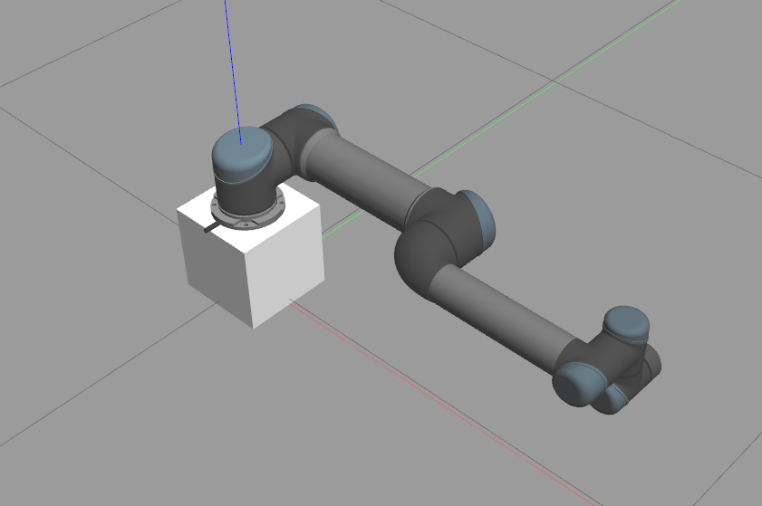

## After launching the GAZEBO, it may hang for a while to download some models. Please, wait 5-10min and kill the simulator once. After then relaunch the simulator again.

# Installation
Install new Python dependencies
~~~~bash
cd "your ROS2 workspace"/src/CS477_IIR_2024S/assignment_1
pip3 install -r requirements.txt
~~~~

Install gym-gazebo2
~~~~bash
cd "your ROS2 workspace"/src/CS477_IIR_2024S/platform/gym-gazebo2
pip3 install -e .
~~~~

Then, update dependencies using colcon
~~~~bash
cd "your ROS2 workspace"
source /opt/ros/foxy/setup.bash
rosdep install --from-paths src --ignore-src --rosdistro=foxy -y
colcon build --symlink-install
~~~~

# Problem 1
You can test the cartpole gym-gazebo2 by running a random action script:
~~~~bash
python3 src/CS477_IIR_2024S/assignment_1/assignment_1/gazebo_cartpole_pid_v0.py -g -r
~~~~
where the environment will be automatically reset when the pole falls over.

You need to complete the gazebo_cartpole_xxx_v0.py code and analyze the performance. 

# Problem 2
Launch the UR5 robot on Terminal 1:
~~~~bash
ros2 launch ur5_ros2_gazebo ur5_simulation_1dof.launch.py 
~~~~

First, complete the PD controller part of move_joint.py.
Then, you can keep moving the shoulder_pan_joint by running following command on Terminal 2:
~~~~bash
# The code properly runs after you implement PD controller part of move_joint.py
ros2 run assignment_1 move_joint
~~~~

After you select P / D gains, the code automatically moves the joint toward the goal position.
Keep in mind that wrong gains may lead to awkward movements.
Please implement correct controller and select different gains to analyze the performance.

    Screenshot of the problem2 robot posture. 
     

<!--  -->

# FAQ
After cancelling the gym-gazebo, there may be still running processes. Please, kill those manually by using

~~~~bash
kill $(ps aux | grep 'gz' | awk '{print $2}')
~~~~
or
~~~~bash
kill $(ps aux | grep 'ros' | awk '{print $2}')
~~~~
